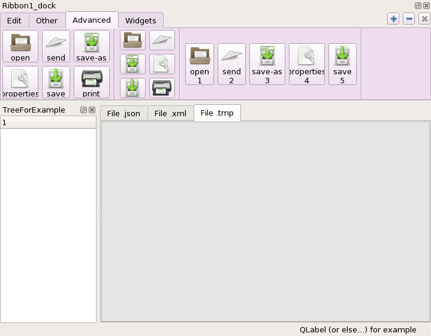

.. ribbonpy documentation master file, created by
   sphinx-quickstart on Fri Apr  1 13:06:31 2016.
   You can adapt this file completely to your liking, but it should at least
   contain the root `toctree` directive.

Documentation ribbonpy
========================

Package ribbonpy is *prototype of API* implementation of a *ribbon widget* (as *ruban widget* in french) in python language, using binding PyQt5_ (and for now PyQt4 compatible in v0.0.0).

Goal is *hypothetic* integration of its feature in SALOME_.

.. toctree::
   :maxdepth: 2

   introduction
   prerequis
   configuration

A simple example
-----------------

Indices and tables
------------------

* :ref:`genindex`
* :ref:`modindex`
* :ref:`search`

