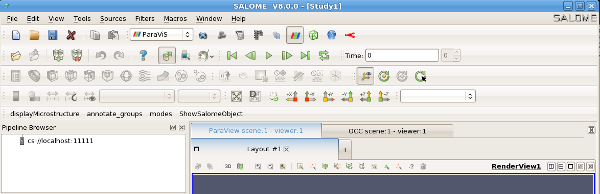

.. _introduction: 

Introduction
==============

What is a ribbon widget
-----------------------

A ribbon widget is an *almost-fixed-sized* toobar with 
PushButtons an ComboBoxes and LineEdit etc..., 
*more-statically* organized with *more-texts-inside* than a classical chaotic set of toolbars.

Goal of ribbon widget is packaging a *not-so-big* constantly sized zone for user acces actions.
Displaying quickly *many* differents contexts of widgets 
*without* overriding and resizing the *central-desktop-zone*
which is (below ribbon) the edited document zone in Word editor, for example.

Currently we see that a ribbon widget is a QTabWiget (from Qt).

By examples:

A classical well-known set of toolbars, (which is *not* a ribbon):

.. image:: images/windows-10-word-95.jpg
   :align: center

Another classical well-known set of toolbars, (which is *not* a ribbon):

A ribbon widget (from Word recent release):

.. image:: images/word2012.png
   :align: center

A ribbon widget (from SolidWorks):

.. image:: images/solidworks1.png
   :align: center

Implementation
-----------------------

Currently we see that a ribbon widget could be implemented as a inherited class of QTabWidget_ (from Qt_).
It is done in this package. 

The resulting class RibbonWidget_ could be used in a QMainWindow_, included as a QToolBar, *or* included as a QDockWidget, its as your convenience for *simulate* desktop SALOME_.

The resulting class QMainWindowForRibbon is a inherited class of QMainWindow_, for first example of standalone demonstration.

